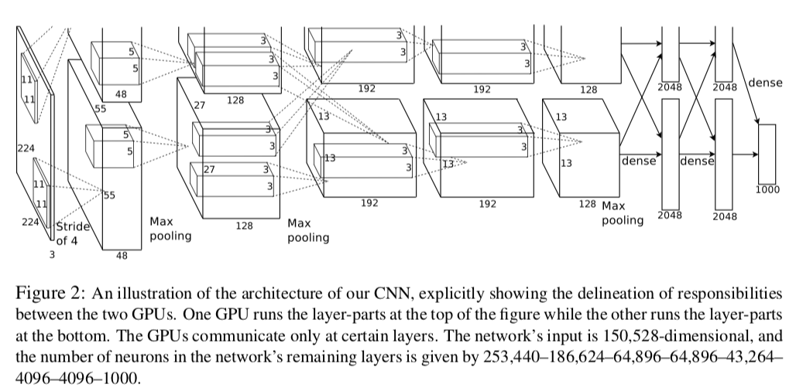

# AlexNet
## 简介
上一个深度学习模型是在1998年提出来的LeNet-5,之后深度学习好像沉寂了好久了，直到[AlexNet](http://www.cs.toronto.edu/~fritz/absps/imagenet.pdf)横空出世，在Imagenet上取得state-of-the-art结果，将深度学习再次带到了人们的视野。为什么会隔这么久，而且会去的这么好的效果？首先当时(LeNet)没有大规模的数据集可用，无法发挥深度神经网络的优势，其次受计算硬件的限制，虽然AlexNet使用的GPU很弱，GTX580，3GB显存，需要使用两块GPU并行训练，然后是AlexNet网络本身比LeNet要深，而且使用更多的技巧。

AlexNet整体上与LeNet很相似,但规模要大很多

## 整体结构：
- 网络如上图所示由5层卷积和三层全连接组成，输入为224224*3
- ReLU:- 标准的CNN模型采用tanh或sigmoid激活函数，但是在进行梯度下降时，神经元梯度会趋于饱和，参数更新速度慢，所以文章采用non-saturating nonlinearity的ReLU,f(x)=max(0, x)
- Local Response Normalization:局部响应归一化，提高模型泛化能力，在激活之后使用，现在基本被BN所取代。没有深究
- Overlapping pooling:传统的池化层，ksize=stride，两两之间没有重叠，但是作者发现如果设置ksize>stride，top1错误率会减少0.4%左右，而且更不容易过拟合
- 此外还采用两个减轻过拟合的方法：data argumentation和Dropout